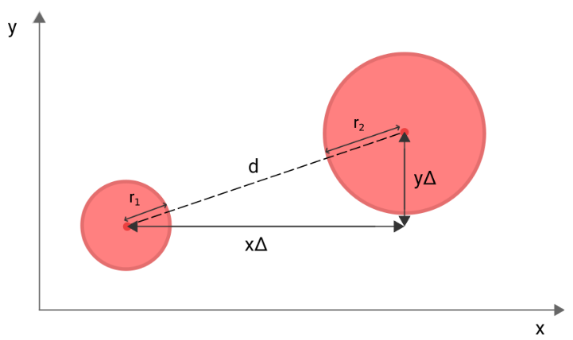
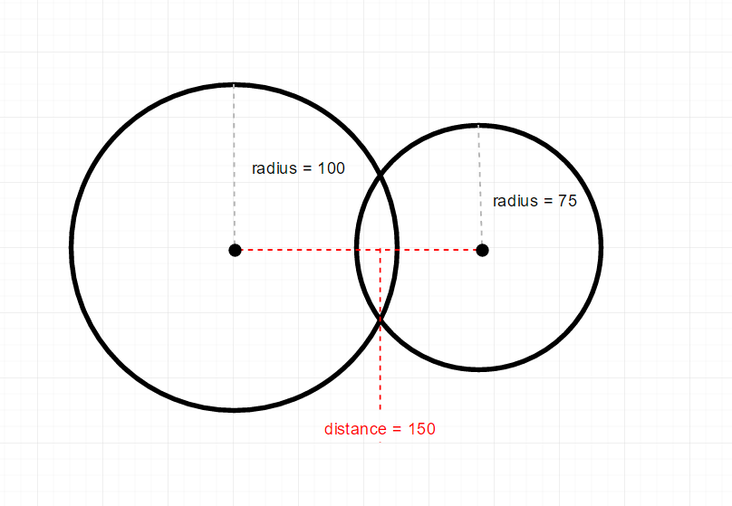
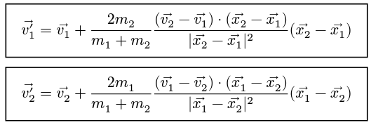

# Coding Challenge: Colisão Elástica


Este projeto visa simular um sistema de colisão elástica entre bolinhas 2D e entender a física e a matemática relacionada para conseguir resolver os problemas ao longo do processo de implementação. Para o desenvolvimento desse projeto foram usadas as seguintes tecnologias:

- C++
- CMake
- SFML

### O que é Colisão elástica?

Colisão elástica é um tipo de colisão onde os corpos não perdem energia cinética e não perdem momentum. Seus valores tanto antes da colisão quanto depois dela não sofrem alteração.

### Disclaimer e Arquivo Utilitário 

Além do código principal, onde está o coração da nossa aplicação, teremos um arquivo a mais chamado utility. Esse arquivo é responsável por guardar algumas funções úteis para nós mas que não necessariamente são imprescindíveis entrarem na explicação do processo de desenvolvimento. 
São funções, como gerar número aleatório considerando um valor mínimo e máximo e carregamento de fonte, além de uma classe para que possamos acompanhar o FPS em Tela. Não  irei passar por esse arquivo.

# Particle

A classe de partícula é responsável por guardar informações relevantes como massa, vetor de velocidade e configurações do shape 2D e encapsular seus dados oferecendo gets e sets. Uma função que é interessante aqui é a de mover.

```c
sf::CircleShape move(float deltaTime)
    {
        // S = S₀ + v ⋅ t
        float x = this->shape.getPosition().x + this->velocity.x * deltaTime;

        float y = this->shape.getPosition().y + this->velocity.y * deltaTime;
    
    [...]
 
```

Nesse projetos utilizaremos a fórmula do MRU - Movimento Retilíneo Uniforme:

- S = S₀ + v Δt

Ou seja, a nova posição é igual a posição atual da partícula mais a velocidade vezes `deltatime` - que é inclusive passado como parâmetro pois ele é capturado a cada laço do looping da main. Assim que sabemos a nova posição de cada eixo, devemos validar se esse novo ponto no espaço encosta ou não nas bordas da tela. Caso sim, invertemos a velocidade daquele eixo para a partícula voltar. 

# Tunneling

Um problema muito comum é a bola atualizar para uma posição além das bordas da janela. Esse problema é conhecido como Tunneling. Para corrigirmos isso, podemos simplesmente pegar a quantidade de espaço sobressalente e reposicionar a bola.

```c
sf::Vector2f handleTunneling(sf::Vector2f coordenate)
{
    // para além da borda direita
    if (coordenate.x + this->radius() > WINDOW_WIDTH)
    {
        this->velocity.x *= -1;
        float overlap = coordenate.x + this->radius() - WINDOW_WIDTH;

        coordenate.x -= overlap;
    }

    // para além da borda esquerda
    if (coordenate.x - this->radius() < 0)
    {
        this->velocity.x *= -1;
        float overlap = abs((coordenate.x - this->radius()) + 0);

        coordenate.x += overlap;
    }

    // para além da borda na parte de baixo
    if (coordenate.y + this->radius() > WINDOW_HEIGHT)
    {
        this->velocity.y *= -1;
        float overlap = coordenate.y + this->radius() - WINDOW_HEIGHT;

        coordenate.y -= overlap;
    }


    // para além da borda no topo
    if (coordenate.y - this->radius() < 0)
    {
        this->velocity.y *= -1;
        float overlap = abs((coordenate.y - this->radius()) + 0);

        coordenate.y += overlap;
    }

    return coordenate;
}
```

# Simulation Class
Essa classe é responsável por lidar com a lógica de criação de partículas, colisão, lidar com o impacto e atualização e criação dos frames. 

A função update é responsável por atualizar a posição das partículas no mundo, as desenhando e verificando se elas colidiram com algo ou não. Nesse primeiro momento, a verificação das colisões está ocorrendo em o(n)², o que não é o ideal, mas para um sistema enxuto de poucas partículas, não nos dará problemas. O foco nesse primeiro momento é entender os conceitos, fórmulas e problemas.

```c
void update(float deltaTime)
{
    for (int i = 0; i < this->particles.size(); i++)
    {
        this->window.draw(this->particles[i].spawn(deltaTime));

        for (int j = i + 1; j < this->particles.size(); j++)
        {
            this->handleCollision(&this->particles[i], &this->particles[j]);
        }
    }
}
```

# Collision Detection

A verificação das colisões dentro da classe `simulation` se dá recebendo duas partículas, A e B a partir do seguinte cenário:

- O segmento de reta resultante do ponto central da particula A e do ponto central da particula B deve ser igual ou menor do que a soma de seus raios.

Caso essa afirmação seja verdadeira, ocorreu uma colisão. Nesse momento, é chamado uma função que lida com o impacto, já que houve colisão.

A questão do momento é: 

> Como podemos capturar essa distância entre dois pontos?

A resposta é simples: pitágoras. 



Subtraímos o local de um círculo pelo outro para capturarmos X,Y e assim fica fácil achar a hipotenusa.

```c
    void handleCollision(Particle *particleA, Particle *particleB)
    {
        float xDistance = abs(particleA->getCenterPoint().x - particleB->getCenterPoint().x);
        float yDistance = abs(particleA->getCenterPoint().y - particleB->getCenterPoint().y);

        // a² + b² = c²
        float h = (xDistance * xDistance) + (yDistance * yDistance);
        float distance = sqrt(h);

        float sumOfRadius = particleA->radius() + particleB->radius();

        if (distance <= sumOfRadius)
        {
            this->handleImpact(particleA, particleB, distance);
        }
    }
```

# Collision Resolution

Após sabermos que as partículas colidiram, precisamos calcular sua nova direção. A direção é o resultado do conjunto das velocidades dos seus eixos. 

### Overlaping

No momento da colisão, é importante checarmos se as partículas estão sofrendo `overlaping` O que acontece é que pode ser que devido à alta velocidade, o deslocamento de posição entre um frame e outro faça com que as partículas fiquem em posições de modo a se sobrepor.



Devemos corrigir essa posição antes de fazermos os cálculos para não gerar bugs de colisão contínua - as partículas ficam "grudadas" colidindo infinitamente. 

Para saber se as partículas estão sofrendo com o `overlaping`, podemos verificar se a soma dos raios é maior do que a distância entre os pontos centrais das partículas.

Caso seja, precisamos pegar o tamanho desse overlap e afastar as partículas de modo que elas fiquem distantes o suficiente para encostarem, mas não se sobreporem.

> <br> Partícula A -> raio 10
> <br> Partícula B -> raio 5
> <br> Raio P.A 10 + raio P.B 5 = 15
> <br> Distância entre os pontos centrais 12
> <br> 12 é menor que 15 então elas estão se sobrepondo.
> <br> 15 - 12 = 3 de overlap.
> <br> Precisamos afastar cada partícula em 1.5 de distância.

A questão é como sabemos quais eixos, para qual direção devemos empurras as partículas. Para sabermos isso, devemos normalizar o vetor da direção das partículas e depois multiplicá-lo pela metade do overlap. 

### Magnitude e Normalização de Vetores

A magnitude (ou tamanho) é a medida do comprimento do segmento de reta gerado entre dois pontos. No nosso caso, é a distância entre a partícula A e B. Agora perceba: nós temos a direção dos centros, temos também o overlap, mas precisamos agora de um vetor que represente as cordenadas que geram esse overlap, no tamanho do overlap, na direcão da colisão dos dois círculos. 

Para conseguirmos capturar esses pontos, precisamos normalizar o vetor de direção, para que possamos ter um vetor com apenas um só sentido e direção, mas com um comprimento de até 1. Normalizar retira a informação de comprimento, mantendo apenas a de direção.

 A normalização de um vetor se dá pela fórmula: 

- magnitude (ou comprimento) = sqrt(x² + y²)
- vetor normalizado = (x / magnitude, y / magnitude)

A distância de deslocamento necessária podemos calcular pegando cada eixo do vetor normalizado e multiplicando por metade do overlap. Metade pois estamos deslocando ambas as partículas, então cada partícula vai se afastar um pouco.

- distância a ser corrigida: ( x * (overlap / 2) ,  y * (overlap / 2)) 

Isso nos dará o quanto que deveremos deslocar a partícula. A partícula A podemos empurrar para um lado e a partícula B para o outro.

```c
void handleOverlap(Particle *particleA, Particle *particleB, float distance)
{
    float idealDistance = particleA->radius() + particleB->radius();

    if (distance >= idealDistance)
    {
        return;
    }

    std::cout << "Overlaping!" << "\n";
    float overlap = (idealDistance - distance);

    sf::Vector2f direction = particleB->getCenterPoint() - particleA->getCenterPoint();
    sf::Vector2f normalizedDirection = direction / distance;
    sf::Vector2f pushBack = normalizedDirection * (overlap / 2);

    // aqui podemos usar setPosition() ou move() do próprio SFML
    // mas estou usando set Position para ficar mais evidente o que 
    // está acontecendo
    particleA->setPosition(particleA->getCenterPoint() - pushBack);
    particleB->setPosition(particleB->getCenterPoint() + pushBack);
    return;
}
```

Agora que identificamos o contato entre as partículas, devemos resolver outro problema: depois delas colidirem, qual será seu novo vetor de velocidade?

Lembrando que o vetor de velocidade traduz consigo a direção no qual a partícula está se movendo. Como eu consigo saber para onde elas irão se mover depois de se chocarem?

# Collision Resolution



A Resolução de Colisão é a fórmula que busca responder essa questão. Eu não irei passar pelo processo matemático de como chegar nesse resultado porque não é o intuito aqui. Vou deixar vinculado no final deste documento as fontes e materiais de estudo com mais detalhes.

O fato é que essa fórmula utiliza de muitos conceitos que nós já trabalhamos aqui como aritimética de vetores, e mais alguns outros interessantes que vale a pena entender.

Conseguimos subdividir essa fórmula em três fórmulas menores de forma com que seja mais fácil de entender.

### Mass Factor


O fator de massas representa a influência na hora da colisão de um corpo no outro. A fórmula é simples e bem direta. Só temos que tomar cuidado com qual é a massa no numerador, pois isso vai afetar diretamente o resultado final. Se estamos calculando a influência da partícula B na partícula A, ou vice versa.


```c
float massFactor = 2.f * particleB->getMass() / (particleA->getMass() + particleB->getMass());
```

### Scalar Projection


A projeção escalar representa a velocidade na qual ambas as partículas estão se aproximando uma da outra ao longo da linha de impacto. Para entendermos melhor vamos separar tanto aqui quanto no código em denominador e numerador, assim fica mais fácil de entender.

No númerador temos a velocidade relativa - que se dá entre a subtração dos vetores de velocidade - vezes a linha de impacto. 
```c
sf::Vector2f relativeVelocity = particleB->getVelocity() - particleA->getVelocity();
```


> Line of Impact <br>
> -- 
> Chamamos de Linha de Impacto a linha que corta os dois pontos centrais das partículas. Ela é o vetor que representa a distância entre a partícula A e B no momento da colisão.

```c
sf::Vector2f lineOfImpact = particleB->getCenterPoint() - particleA->getCenterPoint();
```

Já o numerador é a magnitude do vetor elevado ao quadrado. Uma coisa que é interessante observar aqui é que _magnitude e o módulo são sinônimos_. Enquanto o módulo de uma grandeza escalar é o número absoluto, o módulo de uma grandeza vetorial é seu comprimento.

```c
float scalarProjectionNumerator = (relativeVelocity.x * lineOfImpact.x) + (relativeVelocity.y * lineOfImpact.y);

float scalarProjectionDenominator = (lineOfImpact.x * lineOfImpact.x) + (lineOfImpact.y * lineOfImpact.y);

float scalarProjection = scalarProjectionNumerator / scalarProjectionDenominator;
```
# V'

V Prime - ou V linha - é o resultado final, a nova velocidade depois de todos os cálculos. A terceira parte para capturarmos esse valor é juntar as três fórmulas:

> Recapitulando
>--
> P1v' = Vetor de Velocidade inicial + Fator de Massas * Projeção Escalar * Linha de Impacto

```c
sf::Vector2f v1Prime = particleA->getVelocity() + massFactor * scalarProjection * lineOfImpact;
``` 

Lembrando que deve ser feito o cálculo tanto para a primeira partícula quanto para a segunda, se não apenas uma irá mudar de trajetória. 

# Stress Test

Eu tenho um computador atualmente relativamente bom. Com meu computador atual, eu consigo renderizar 800 partículas simultanemante à 30 FPS. Algo que pode ser MUITO melhorado, muito mesmo, caso eu implementasse um outro algoritmo para validação das colisões, como as Quadtrees. Mas isso fica para próxima. :D


## Fontes de Estudo
Conteúdo que foi valiosíssimo para o entendimento desse projeto:

- [Elastic Collision (Wikipedia)](https://en.wikipedia.org/wiki/Elastic_collision)
- [Dipam Sen – Collisions PDF](https://dipamsen.github.io/notebook/page/collisions.pdf)
- [SpicyYoghurt – Collision Physics](https://spicyyoghurt.com/tutorials/html5-javascript-game-development/collision-detection-physics)
- [HappyCoding – Collision Detection](https://happycoding.io/tutorials/processing/collision-detection)
- [Vídeo explicativo](https://www.youtube.com/watch?v=dJNFPv9Mj-Y&t=255s)

# quadtree
